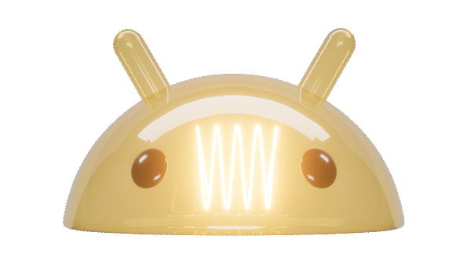

<h1 align="center">Hi 👋, I'm Aviraj Sharma</h1>
<h3 align="center">Android Developer | Kotlin • Jetpack Compose • Clean Architecture</h3>

  

---

## 👨‍💻 About Me

- 📱 Android Developer passionate about building modern Android applications.
- 🚀 Currently working with **Kotlin, Jetpack Compose, MVVM, and Clean Architecture**.
- 🌱 Learning **System Design, KMP, Spring Boot, and AI integration in Android**.
- 💼 Open to Android Developer opportunities.
- 📫 **Email:** `avirajkanhaua0413@gmail.com`

---

## 🛠 Tech Stack

**Languages**
- Kotlin • Java 

**Android**
- Jetpack Compose
- XML
- MVVM
- Clean Architecture
- Coroutines & Flow
- Room
- Navigation
- WorkManager

**Backend & Cloud**
- Firebase
- Ktor

**Tools**
- Android Studio
- Git & GitHub
- Postman
- Gradle
- Figma

---

## 📊 GitHub Stats

  
  

  

---

## 🌐 Connect With Me

  <a href="https://linkedin.com/in/avirajsharma">LinkedIn</a> •
  <a href="https://x.com/aviiraj_sharma">X</a> •
  <a href="https://medium.com/@aviirajsharma">Medium</a> •
  <a href="https://dev.to/aviirajsharma">Dev.to</a> •
  <a href="https://leetcode.com/aviraj_sharma">LeetCode</a>

  

